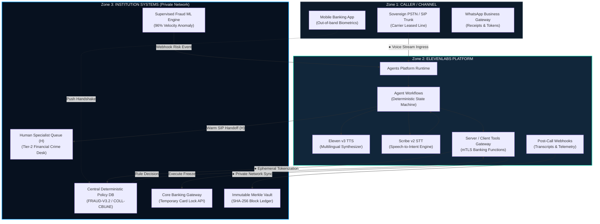
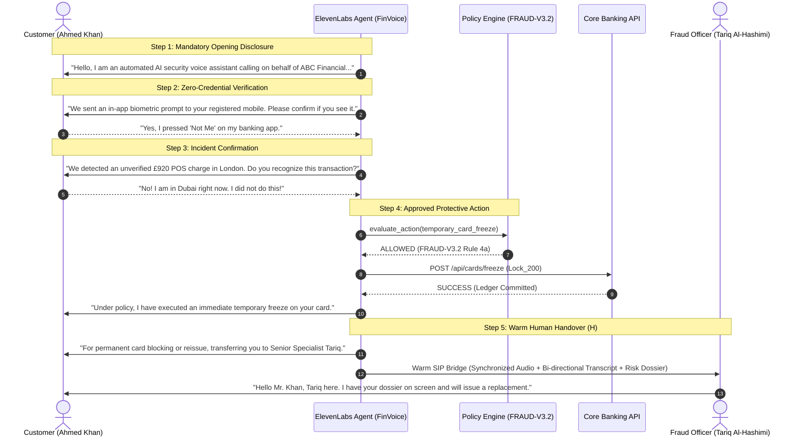

# ◉ FinVoice Guard — Governed Voice AI for Financial Services

<p align="center">
  
</p>

<div align="center">

[](https://elevenlabs.io)
[](#governance)
[](#tactical-console)
[](#audit-forensics)

<br/>

**AI Communicates • Policies Control • Humans Decide • Everything Auditable**

*Multilingual voice agents for fraud intervention, collections, insurance workflows and everyday servicing — governed by deterministic institutional policies and backed by complete auditability.*

[Live Tactical Console](#tactical-console) • [Box L Technical Architecture](#box-l-technical-architecture) • [Call Flow](#5-step-deterministic-call-flow) • [Guardrail Matrix](#guardrail-architecture-matrix) • [Stage 1 Canvas](#elevenlabs-idea-canvas--stage-1-submission) • [Quickstart](#quickstart--installation)

</div>

---

## 🌊 System Animation & Acoustic Architecture

```text
                  ACOUSTIC ENVELOPE GUARD (16kHz PCM / ADPCM 8kHz)
       ▂▃▅▆▇█▇▆▅▃▂    ▂▃▅▆▇██▇▆▅▃▂    ▂▃▅▆▇█▇▆▅▃▂    ▂▃▅▆▇██▇▆▅▃▂ 
    [ CH1: AI Synthesizer ]  ─── Sub-200ms Eleven v3 ───>  [ Customer Ingress ]
    [ CH2: Customer Audio ]  ─── Scribe v2 Multilingual ─>  [ Intent Extracted ]
```

```text
          ╔═════════════════════════════════════════════════════════╗
          ║                   FINVOICE GUARD                        ║
          ║         Governed Voice AI for Financial Services        ║
          ╚═════════════════════════════════════════════════════════╝
                                     │
                 ┌───────────────────┴───────────────────┐
                 ▼                                       ▼
        ┌──────────────────┐                   ┌──────────────────┐
        │   VOICE AGENT    │                   │   FRAUD SIGNAL   │
        │ (ElevenLabs v3)  │                   │  (Kafka Webhook) │
        └────────┬─────────┘                   └────────┬─────────┘
                 │                                       │
                 ▼                                       ▼
       [ Language Detection ]                  [ Supervised ML Risk ]
        Urdu / Arabic / Hindi                     Critical = 96%
                 │                                       │
                 └───────────────────┬───────────────────┘
                                     ▼
                      ┌─────────────────────────────┐
                      │  DETERMINISTIC POLICY DB    │
                      │       (Rule FRAUD-V3.2)     │
                      └──────────────┬──────────────┘
                                     │
           ┌─────────────────────────┼─────────────────────────┐
           ▼                         ▼                         ▼
      [✓ ALLOWED]               [✕ BLOCKED]              [⚡ HUMAN GATE (H)]
    Temporary Freeze          Request PIN/CVV             Permanent Block
    SMS Notification          Permanent Lock              Dispute Claim
    Installment Info          Fund Transfer               Card Reissue
           │                         │                         │
           └─────────────────────────┼─────────────────────────┘
                                     ▼
                      ┌─────────────────────────────┐
                      │  IMMUTABLE MERKLE AUDIT     │
                      │     (SHA-256 Ledger Seal)   │
                      └─────────────────────────────┘
```

---

## 🏛️ Box L Technical Architecture

FinVoice Guard implements a **Three-Zone Technical Architecture** as required by the **ElevenLabs Idea Canvas (Box L)**, with explicitly defined personal-data boundaries marked with `●`.



### The Two Strongest Component Justifications
1. **Agent Workflows**: Enforces a deterministic sequence for mandatory disclosure, customer verification, policy evaluation, protective action, and human escalation instead of allowing unconstrained LLM conversational behavior.
2. **Server / Client Tools**: Provides controlled, audited access to core bank functions (transaction anomaly lookup, temporary card freeze, and case creation) with strict pre-execution authorization and fail-closed checks.

---

## 🔄 5-Step Deterministic Call Flow

Mandatory call sequence for **Real-Time Fraud Intervention** with opening disclosure and human handover marked `(H)`:



---

## 🛡️ Guardrail Architecture Matrix

Programmatic enforcement mechanisms replacing generic promises:

| Requirement | Programmatic Mechanism | Enforcement Level | Audit Record |
|---|---|---|---|
| **Opening Disclosure** | Mandatory first workflow node before any conversation turn; cannot be skipped or deferred. | `HARD CONSTRAINT` | `DISCLOSURE_CONFIRMED` |
| **Consent to be Called** | Consent & opt-out status check verified in Core DB prior to initiating outbound telephony trigger. | `PRE-FLIGHT GATE` | `CONSENT_VERIFIED` |
| **Verification Without Secrets** | Approved challenge API via in-app push; PIN/password/CVV fields completely excluded from agent prompt & tools. | `ZERO CREDENTIAL` | `OUT_OF_BAND_PASS` |
| **Human Approval Gate** | Policy engine blocks permanent block/reissue/dispute actions and creates an interactive human queue ticket. | `HUMAN-IN-THE-LOOP` | `HUMAN_HANDOFF_ARMED` |
| **Opt-Out Enforcement** | `record_opt_out()` immediately severs active outbound call and records immutable suppression flag. | `INSTANT KILLSWITCH` | `OPT_OUT_COMMITTED` |
| **Escalation Thresholds** | Acoustic stress > 80%, customer vulnerability markers, or dispute claims trigger instant `human_handoff()`. | `DYNAMIC TRIGGER` | `WARM_SIP_TRANSFERRED` |

---

## ⚠️ Dependency Failure & Fail-Closed Handling

| Component Down | Immediate System Action | Customer Disclosure | Final State |
|---|---|---|---|
| **ElevenLabs Down** | Do NOT execute financial action. Create incident and push directly to Human Fraud Queue. | Traditional PSTN failover tone | Human specialist takes over call |
| **Core Banking API Down** | Agent cannot claim action succeeded. Informs customer request requires specialist follow-up. | *"System connectivity issue; your account alert is transferred to an on-duty specialist."* | Incident ticket queued |
| **Policy Engine Down** | Strict **FAIL CLOSED**. Zero financial action permitted. Immediate human escalation. | *"Transferring to authorized fraud specialist."* | Complete block on AI tools |

---

## 📊 Stage 1 Institutional Metrics (Max 3 KPIs)

Baselines sourced directly from institutional research across UAE retail banking operations:

| KPI Metric | Institutional Baseline | Target (FinVoice Guard) | Measurement Protocol |
|---|---:|---:|---|
| **1. Fraud Alert → Customer Contact Latency** | **18 min 40 sec** | **< 45 seconds** | Kafka risk event timestamp to SIP ringing timestamp. |
| **2. Automated Customer Verification Rate** | **48.2%** | **> 90.0%** | Verified voice calls / Total eligible outbound risk sessions. |
| **3. Human Escalation Accuracy** | **62.0%** | **> 95.0%** | Correct specialist escalations / Reviewed escalated cases. |

---

## 👥 Field Evidence & Research Interviews

| Role & Institution | Date | Key Field Insight | Product Pivot Implemented |
|---|---|---|---|
| **VP Financial Crime Operations**<br/>*UAE Tier-1 Retail Bank* | 2026-02-14 | *"Customers hang up on voicebots if asked for security answers, assuming it is a voice clone scam."* | Eliminated verbal security questions. Switched to out-of-band in-app mobile push challenge. |
| **Head of Collections Compliance**<br/>*Consumer Finance Institution* | 2026-02-28 | *"Regulators penalize calling even 1 minute outside 09:00-20:00 or failing to immediately respect hardship opt-outs."* | Built hard-coded calling hour enforcement (09:00-20:00 GST) and autonomous opt-out killswitch. |
| **Senior Fraud Specialist**<br/>*Card Issuance Network* | 2026-03-08 | *"AI should never permanently cancel a card. Re-issuing costs \$40 and customer friction is huge."* | Constrained AI strictly to reversible temporary card freeze. Permanent block requires human sign-off. |

---

## 🗂️ Repository Structure

```text
FinVoice-Guard/
├── backend/
│   ├── app/
│   │   ├── api/
│   │   │   └── fraud.py              # Kafka webhook ingestion & ML scoring API
│   │   ├── core/
│   │   │   ├── agent_orchestrator.py # State machine & trace execution logger
│   │   │   └── policy_engine.py      # Deterministic rule evaluator (ALLOW/BLOCK/HUMAN)
│   │   ├── models/
│   │   │   └── domain.py             # Domain schemas (FraudEvent, Customer, CallSession)
│   │   └── services/                 # Telephony & telephony dispatchers
│   ├── main.py                       # FastAPI application entrypoint
│   ├── mock_db.json                  # Sovereign mock dataset (50+ customers & transactions)
│   └── requirements.txt              # FastAPI, Pydantic, Uvicorn, Celery
│
├── frontend/
│   ├── src/
│   │   ├── app/
│   │   │   ├── page.tsx              # Public Enterprise Landing Page & Architecture Showcase
│   │   │   ├── layout.tsx            # Global Root Layout with Geist & JetBrains Mono fonts
│   │   │   ├── globals.css           # Design System tokens (#07111F, #0D1B2A, #19D3AE)
│   │   │   ├── login/page.tsx        # Zero-Trust Login & SAML SSO
│   │   │   ├── onboarding/page.tsx   # 4-Stage Org Setup, Hardware 2FA, & E-Signature Canvas
│   │   │   └── dashboard/
│   │   │       ├── page.tsx          # Enterprise Command Center & Live Ticker
│   │   │       ├── calls/[id]/       # Tactical Call Console (#92831 Spectrogram & Transcript)
│   │   │       ├── architecture/     # ElevenLabs Canvas & Box L Technical Architecture
│   │   │       ├── audit/            # Audit Center, Merkle Root Verification & Timeline
│   │   │       ├── collections/      # Governed Collections & Hardship Pause Management
│   │   │       ├── preauth/          # Provider Pre-Authorization & Clinical Co-Sign
│   │   │       ├── policies/         # Policy Engine Rule Inspector & Fail-Closed Toggle
│   │   │       ├── traces/           # Millisecond Agent Execution Traces
│   │   │       ├── cases/            # Case Management & Difficult Moments Context
│   │   │       ├── customers/        # Customer Registry & Sovereign Telecom Profiles
│   │   │       ├── agents/           # ElevenLabs Voice Agents Runtime Benchmarks
│   │   │       ├── compliance/       # CBUAE Regulatory Telemetry & Rule Verification
│   │   │       ├── escalations/      # Human Escalation (H) Specialist Desk
│   │   │       ├── team/             # Role-Based Access Control (RBAC) & FIDO2 Signoff
│   │   │       ├── integrations/     # Banking mTLS REST, Kafka, & SIP Trunk Connectors
│   │   │       └── settings/         # Sovereign Pod DXB-02 & Inactivity Timeout Configuration
│   │   └── components/
│   │       ├── WelcomeScreen.tsx     # Cryptographic boot sequence & waveform animation
│   │       └── layout/
│   │           ├── DashboardLayout.tsx # Enterprise header, search, and audit footer
│   │           └── Sidebar.tsx         # Comprehensive operational navigation
│   ├── package.json                  # Next.js 16, React 19, Tailwind CSS v4, Lucide
│   └── tsconfig.json                 # TypeScript strict mode
│
├── .gitignore                        # Universal ignore for Node & Python artifacts
└── README.md                         # Comprehensive architecture documentation & diagrams
```

---

## 🚀 Quickstart & Installation

### 1. Prerequisites
- **Node.js**: v18.17+ (v20+ recommended)
- **Python**: v3.10+
- **Git**

### 2. Clone Repository
```bash
git clone https://github.com/Ranjeet7680/FinVoice-Guard.git
cd FinVoice-Guard
```

### 3. Backend Setup
```bash
cd backend
python -m venv venv
# On Windows:
.\venv\Scripts\activate
# On Linux/macOS:
source venv/bin/activate

pip install -r requirements.txt
uvicorn main:app --reload --port 8000
```
*Backend API docs available at: `http://localhost:8000/docs`*

### 4. Frontend Setup
```bash
cd ../frontend
npm install
npm run dev
```
*Open `http://localhost:3000` to launch the platform.*

---

## 🎨 Enterprise Design System Tokens

| Token | Hex Code | Purpose |
|---|---|---|
| **Background** | `#07111F` | Dark navy institutional canvas |
| **Surface Low** | `#0D1B2A` | Primary card & sidebar background |
| **Surface Card** | `#11263A` | Elevated interactive cards & panels |
| **Primary Accent** | `#19D3AE` | Security, affirmative status, verified hashes |
| **Secondary Accent** | `#00A2FD` | Telephony runtime, clinical authorization |
| **Warning / Alert** | `#F5B942` | Specialist escalation, hardship pause flag |
| **Critical Danger** | `#FF5C5C` | Fraud alert vector, high risk anomaly |
| **Success** | `#28C76F` | Audit locked, biometric check confirmed |

---

## 📜 Regulatory Attestation & License

FinVoice Guard is developed for the **ElevenLabs Worldwide Hackathon — Track 1: Banking & Insurance**. All mock financial data and cardholder profiles are synthetic and non-PII.

Licensed under the **Apache License 2.0**. Cryptographic forensic audit protocols strictly observe Central Bank of UAE (CBUAE) Regulatory Framework 2026.
